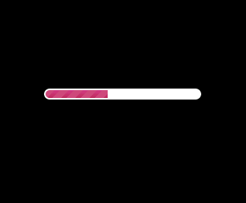
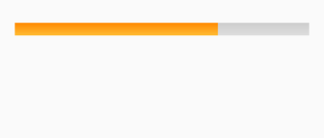

# ProgressView
A LaatonWalaBhoot creation...




Progress Bar for Android with custom background and track colors.

Compatible with custom Drawables.

Set Custom radius and animation delay(seconds) for filling up the progress view. 

# Usage
```
<com.laatonwalabhoot.ProgressView
    xmlns:app="http://schemas.android.com/apk/res-auto"
    android:id="@+id/progress"
    android:layout_width="80dp"
    android:layout_height="4dp"
    app:progress="60"
    app:radius="5dp"
    app:animation_delay="3"
    app:progress_color="#D3D3D3"
    app:progress_background_color="#FFFFFF"/>
    
```

# Limitaions
Indeterminate version not available

Setting text to both ends of progress bar not available.

Vertical orientation still needs testing
